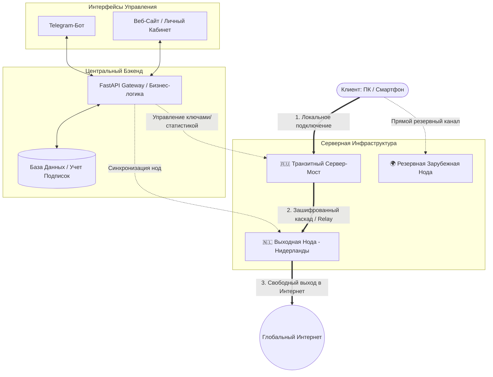

# ⚡ Автоматизированная VPN-Платформа и Инфраструктура Подписок

> **Отказоустойчивый коммерческий комплекс для автоматизированного управления VPN-подписками, включающий Telegram-бота, веб-сайт/личный кабинет и распределенную сеть из 3 серверов с каскадной маршрутизацией (Multi-Hop) через транзитный шлюз в Нидерланды.**

---

## 📌 Архитектура и Топология Сети

Сервисная сеть спроектирована по принципу **каскадного туннелирования (Multi-Hop)**. Пользователь подключается к быстрому отечественному транзитному серверу, который по защищенному магистральному каналу перенаправляет зашифрованный трафик на внешний выходной сервер в Нидерландах. Это гарантирует минимальный пинг, обход белых списков/ТСПУ и стабильный доступ к глобальной сети.

---

## 🚀 Ключевой Функционал Системы

- **🤖 Мультиканальное управление (Web + Telegram):**
  - **Telegram-бот:** Мгновенный выпуск подписок, пополнение баланса, выдача ключей и генерация динамических QR-кодов.
  - **Веб-сайт / Панель:** Личный кабинет пользователя, статистика трафика, веб-инструкции по настройке приложений.
- **🛡️ Каскадный Multi-Hop туннель:**
  - Трафик маскируется под обычный HTTPS-трафик на транзитном сервере и перенаправляется на высокоскоростную ноду в **Нидерландах (Амстердам)**.
  - Устойчивость к ТСПУ, DPI-блокировкам и замедлению протоколов провайдерами.
- **⚡ Протоколы нового поколения:** 
  - Развертывание **VLESS + XTLS-Reality**, **Shadowsocks-2022** и **Trojan**.
  - Полная поддержка приложений: `v2rayNG`, `Happ`, `Streisand`, `NekoBox`, `Shadowrocket`.
- **🔄 Пул из 3 серверов:**
  - `Сервер 1 (Транзитный / Relay)` — входная точка с минимальной задержкой.
  - `Сервер 2 (Основной / Edge NL)` — гигабитный сервер в Нидерландах без ограничений.
  - `Сервер 3 (Резервный / Backup)` — независимый зарубежный шлюз для отказоустойчивости.
- **💳 Автоматизация биллинга:** Асинхронные вебхуки платежных шлюзов, мгновенная активация и продление тарифов, автоматическое отключение истекших сессий.

---

## 🛠️ Стек Технологий

| Компонент | Технологический стек |
| :--- | :--- |
| **Бэкенд и API** | Python 3.12, `FastAPI`, `Pydantic v2`, `Uvicorn` |
| **Telegram-интерфейс** | `aiogram 3.x` (FSM, кастомные фильтры и мидлвари) |
| **Веб-интерфейс** | Современный адаптивный веб-сайт (SPA / Web Dashboard) |
| **База данных** | `SQLAlchemy 2.0 (Async)`, `AioSQLite` / `Redis` |
| **Сетевое ядро** | `Xray-core` (VLESS-Reality), Nginx (Reverse Proxy + TLS) |
| **Деплой & DevOps** | `Docker Compose`, `systemd`, `Bash-скрипты автоматизации` |

---

## 🔒 Безопасность и Приватность

1. **Zero-Logs:** На транзитных и выходных серверах логи пользовательского трафика не сохраняются на диск.
2. **Изоляция:** Сервисы развернуты в изолированных Docker-контейнерах с разделением прав доступа.
3. **Безопасная передача:** Обмен данными между бэкендом и нодами защищен шифрованием и закрытыми API-токенами.

---

## 👨‍💻 Разработчик

- **Автор проекта:** Войнарский Егор
- **GitHub:** [@evoynarskiy-dev](https://github.com/evoynarskiy-dev)
- **Telegram:** [@egorrvvo](https://t.me/egorrvvo)

---
*Примечание: Исходные конфигурационные файлы боевых серверов, приватные ключи и закрытый код биллинга вынесены в приватные репозитории в целях безопасности инфраструктуры.*
